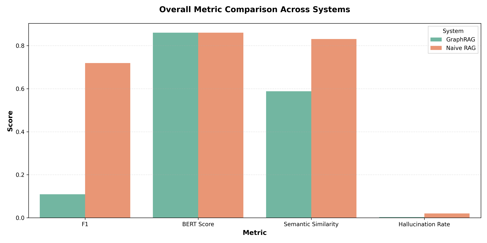
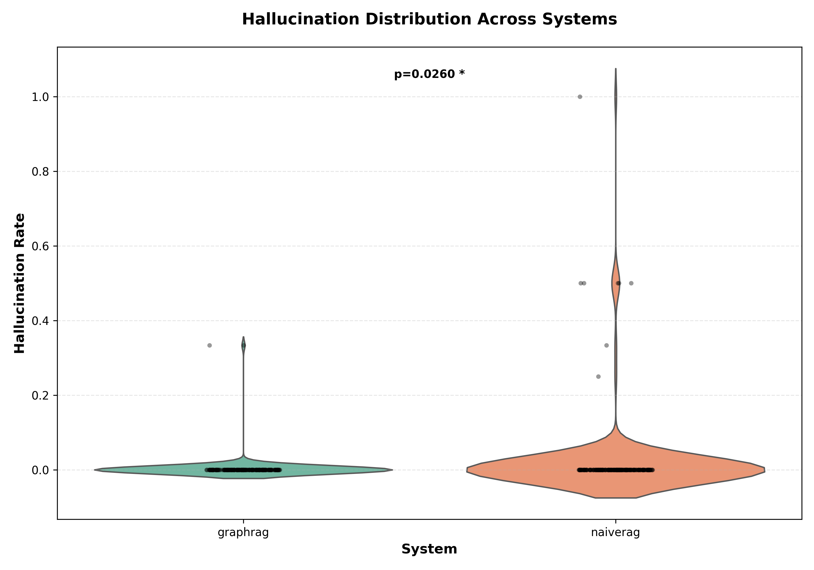
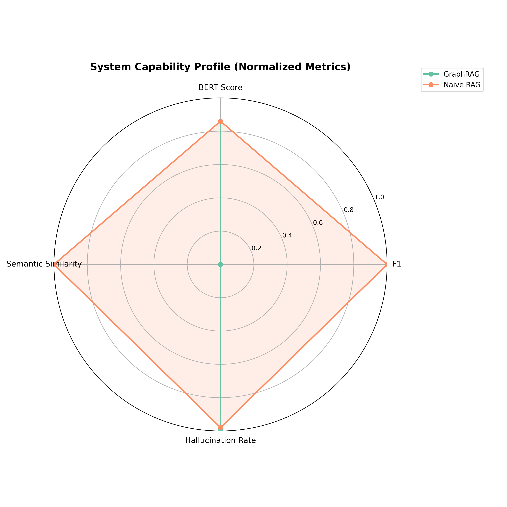
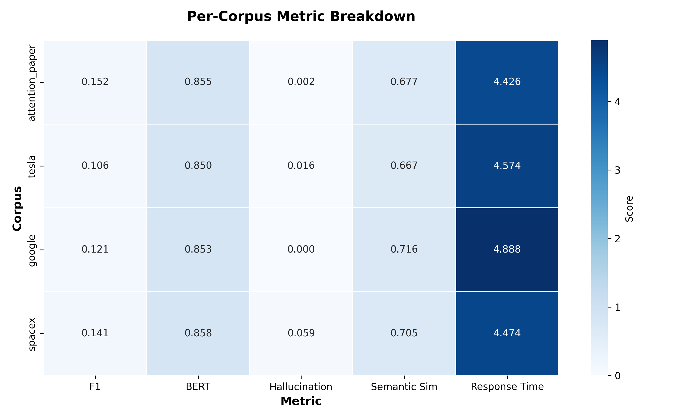
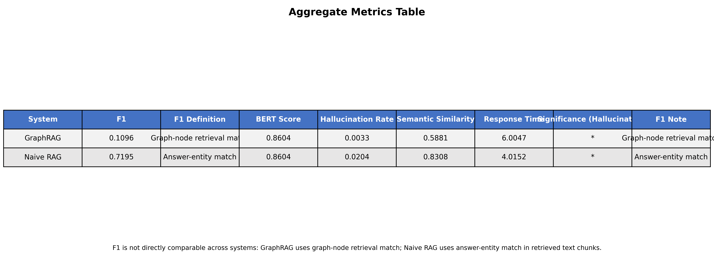

# Beyond Vector Search: Mitigating LLM Hallucinations via Graph-Based Retrieval-Augmented Generation (GraphRAG)

## Project Metadata
- Project Title: Beyond Vector Search: Mitigating LLM Hallucinations via Graph-Based Retrieval-Augmented Generation (GraphRAG)
- Authors: Arnav Deshpande; Sarvesh Nimbalkar; Dhruv Gadia; Aadi Rawat
- Organization: Mukesh Patel School of Technology and Management, NMIMS University
- Contact Email: [deshpandearnavn@gmail.com](mailto:deshpandearnavn@gmail.com)
- GitHub Repository: https://github.com/andy1924/Graph-RAG

## Overview
This repository contains a graph-based retrieval-augmented generation pipeline and a NaiveRAG baseline. The system is designed for controlled comparison of grounding quality, hallucination behavior, and retrieval behavior across four corpora: attention_paper, tesla, google, and spacex.

The implementation includes:
- Graph-based ingestion into Neo4j with multimodal context handling.
- Question answering via graph retrieval and LLM response generation.
- A NaiveRAG baseline for comparative evaluation.
- Comprehensive experimental scripts and significance testing.

## Repository Structure
```text
Graph_RAG/
├── main.py
├── scripts/
│   ├── ingest.py
│   ├── query.py
│   └── evaluate.py
├── experiments/
│   ├── comprehensive_evaluation.py
│   ├── naiverag_evaluation.py
│   ├── multimodal_ablation.py
│   └── significance_analysis.py
├── src/
│   ├── graphrag/
│   │   ├── retrieval.py
│   │   ├── evaluation/metrics.py
│   │   └── ingestion/
│   └── naiverag/
├── data/
├── results/
└── docs/
```

## Method Summary
1. Ingestion
- GraphRAG: document processing and graph construction into Neo4j.
- NaiveRAG: chunk-based retrieval index construction.

2. Retrieval and Answering
- GraphRAG: entity-centric graph context retrieval from node/edge structure.
- NaiveRAG: chunk retrieval from text index.

3. Evaluation
- Per-question metrics include retrieval metrics, semantic similarity, ROUGE, BERTScore, hallucination rate, grounded ratio, and response time.
- Significance analysis now reports per-metric inferential statistics.

## Results Snapshot (from current results JSON)
Aggregates below are taken from results/comprehensive_evaluation.json, results/naiverag_evaluation.json, and results/significance_analysis.json.

| Metric | GraphRAG | NaiveRAG |
|---|---:|---:|
| Retrieval F1 | 0.1096 | 0.7195 |
| Hallucination Rate | 0.0033 | 0.0204 |
| Semantic Similarity | 0.5881 | 0.8308 |
| BERTScore | 0.8604 | 0.9011 |
| ROUGE-1 proxy | 0.2588 | 0.4856 |
| Avg Response Time (s) | 6.0047 | 4.0152 |

Important metric-definition note:
- GraphRAG retrieval F1 is computed from graph-node matching logic.
- NaiveRAG retrieval F1 is computed from answer-entity matching in retrieved chunks.
- These F1 values are therefore not directly comparable without harmonized retrieval definitions.

### Significance Summary (paired where aligned)
- Hallucination rate: Wilcoxon p = 0.02598; mean difference (GraphRAG - NaiveRAG) = -0.01708.
- Semantic similarity: Wilcoxon p = 5.51e-32; mean difference = -0.24265.
- ROUGE-1 proxy: Wilcoxon p = 6.95e-29; mean difference = -0.22681.
- BERTScore: Wilcoxon p = 1.66e-29; mean difference = -0.04069.

## Visual Results
- 
- 
- 
- 
- 

## Reproducibility
### Environment
- Python 3.10+
- Neo4j (Aura or local instance)
- OpenAI API key

### Setup
```bash
git clone https://github.com/andy1924/Graph-RAG
cd Graph-RAG
python -m venv .venv
.venv\Scripts\activate
pip install -r requirements.txt
```

### Core commands
```bash
# Ingestion
python main.py ingest --all

# Interactive query
python main.py query --mode graphrag
python main.py query --mode both

# Evaluation suite
python main.py evaluate --experiment comprehensive
python main.py evaluate --experiment naiverag
python main.py evaluate --experiment significance

# Visualization
python experiments/visualize_results.py
```

## Limitations
- Retrieval F1 definitions differ between GraphRAG and NaiveRAG; inferential comparison on F1 is intentionally disabled in significance outputs.
- Aggregate results are sensitive to corpus composition and question formulation.
- Response latency includes external API calls and environment-dependent variability.

## Documentation Index
- docs/QUICKSTART.md
- docs/ARCHITECTURE.md
- docs/EVALUATION.md
- docs/USAGE.md
- docs/RESEARCH_GOAL.md

## Citation
```bibtex
@misc{graphrag2026,
  title        = {Beyond Vector Search: Mitigating LLM Hallucinations via Graph-Based Retrieval-Augmented Generation (GraphRAG)},
  author       = {Arnav Deshpande and Sarvesh Nimbalkar and Dhruv Gadia and Aadi Rawat},
  year         = {2026},
  institution  = {Mukesh Patel School of Technology and Management, NMIMS University},
  howpublished = {\url{https://github.com/andy1924/Graph-RAG}}
}
```

