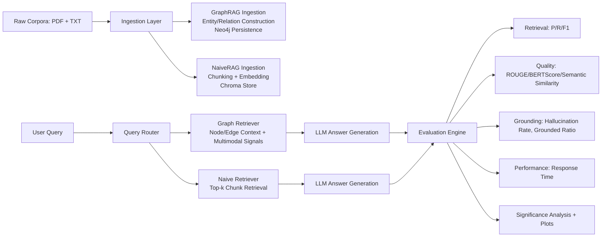

# Beyond Vector Search: Mitigating LLM Hallucinations via Graph-Based Retrieval-Augmented Generation

<p align="center">
  
</p>

<p align="center">
  <strong>GraphRAG</strong> + <strong>NaiveRAG Baseline</strong> + <strong>Significance Testing</strong> + <strong>Multimodal Evaluation</strong>
</p>

## Project Metadata

- **Title:** Beyond Vector Search: Mitigating LLM Hallucinations via Graph-Based Retrieval-Augmented Generation (GraphRAG)
- **Authors:** Arnav Deshpande, Sarvesh Nimbalkar, Dhruv Gadia, Aadi Rawat
- **Affiliation:** Mukesh Patel School of Technology and Management, NMIMS University
- **Contact:** deshpandearnavn@gmail.com
- **Repository:** https://github.com/andy1924/Graph-RAG

---

## Why This Repository Exists

Classical chunk-based RAG systems optimize lexical/semantic similarity but can still hallucinate when evidence is scattered across entities, relations, tables, and figures. This project evaluates a **multimodal property-graph retrieval architecture (GraphRAG)** against a **NaiveRAG chunk baseline** under a controlled, corpus-aligned setup.

Core research question:

> Can graph-structured retrieval reduce unsupported claims (hallucinations) relative to chunk retrieval, while preserving useful answer quality?

---

## Technical Contributions

1. **Multimodal GraphRAG pipeline** for text/PDF ingestion, graph construction, Neo4j retrieval, and grounded generation.
2. **NaiveRAG baseline** backed by chunk indexing for side-by-side comparison.
3. **Unified evaluation suite** with retrieval metrics, answer-quality metrics, grounding metrics, and latency.
4. **Inferential analysis layer** (Wilcoxon / Mann-Whitney fallback + Cohen's d).
5. **Visual analytics outputs** for aggregate and per-corpus behavior.

---

## System Architecture



---

## Repository Layout

```text
Graph_RAG/
├── main.py
├── scripts/
│   ├── ingest.py
│   ├── query.py
│   └── evaluate.py
├── src/
│   ├── graphrag/
│   │   ├── ingestion/
│   │   │   ├── multimodal_ingestion.py
│   │   │   └── graph_generator.py
│   │   ├── retrieval.py
│   │   ├── evaluation/metrics.py
│   │   └── utils/
│   └── naiverag/
│       ├── ingestion.py
│       └── retrieval.py
├── experiments/
│   ├── comprehensive_evaluation.py
│   ├── naiverag_evaluation.py
│   ├── multimodal_ablation.py
│   ├── significance_analysis.py
│   └── visualize_results.py
├── data/
├── results/
├── docs/
└── project_documentation/
```

---

## Experimental Scope

- **Corpora:** `attention_paper`, `tesla`, `google`, `spacex`
- **Pipelines compared:** GraphRAG vs NaiveRAG
- **Evaluation dimensions:** retrieval fidelity, answer quality, grounding behavior, efficiency
- **Statistics:** per-metric significance from paired outputs where alignment exists

---

## Current Results Snapshot (Repository JSON)

Source files:
- `results/comprehensive_evaluation.json`
- `results/naiverag_evaluation.json`
- `results/significance_analysis.json`

| Metric | GraphRAG | NaiveRAG |
|---|---:|---:|
| Retrieval F1 | 0.1096 | 0.7195 |
| Hallucination Rate | 0.0033 | 0.0204 |
| Semantic Similarity | 0.5881 | 0.8308 |
| BERTScore | 0.8604 | 0.9011 |
| ROUGE-1 Proxy | 0.2588 | 0.4856 |
| Avg Response Time (s) | 6.0047 | 4.0152 |

Per-metric significance highlights:

- Hallucination rate: **Wilcoxon p = 0.02598**, mean diff (GraphRAG - NaiveRAG) = **-0.01708**
- Semantic similarity: **Wilcoxon p = 5.51e-32**, mean diff = **-0.24265**
- ROUGE-1 proxy: **Wilcoxon p = 6.95e-29**, mean diff = **-0.22681**
- BERTScore: **Wilcoxon p = 1.66e-29**, mean diff = **-0.04069**

### Retrieval F1 Comparability Caveat

`retrieval_f1` is currently defined differently across GraphRAG and NaiveRAG evaluation pipelines. Use these values for within-system diagnostics, not strict apples-to-apples cross-system inference, until target definitions are harmonized.

---

## Poster-Derived Technical Context

From `project_documentation/Technical Poster.png`:

- GraphRAG modeled as **multimodal property graph** with typed entities and explicit relations.
- Poster reports a marked hallucination reduction trend for graph-grounded retrieval.
- Dataset setup references a large QA workload with human-annotated question-answer pairs.
- Evaluation emphasizes trade-off between grounding fidelity and response latency.

These points are preserved here as design rationale; repository JSON files remain canonical for reproducible numeric claims.

---

## Visual Outputs

| Output | File |
|---|---|
| Grouped metric bars | `results/visual_output/fig1_grouped_bar_chart.png` |
| Hallucination distribution | `results/visual_output/fig2_violin_strip_plot.png` |
| Capability radar | `results/visual_output/fig3_radar_chart.png` |
| Per-corpus heatmap | `results/visual_output/fig4_heatmap.png` |
| Aggregate metrics table | `results/visual_output/tab1_aggregate_metrics.png` |
| Aggregate metrics CSV | `results/visual_output/tab1_aggregate_metrics.csv` |

---

## Reproducibility

### Prerequisites

- Python 3.10+
- Neo4j (Aura or local)
- OpenAI API key

### Installation (Windows PowerShell)

```bash
git clone https://github.com/andy1924/Graph-RAG
cd Graph-RAG
python -m venv .venv
.venv\Scripts\activate
pip install -r requirements.txt
```

### Environment Variables

Create `.env` in repo root:

```dotenv
OPENAI_API_KEY=...
NEO4J_URI=...
NEO4J_USERNAME=...
NEO4J_PASSWORD=...
NEO4J_DATABASE=neo4j
```

### End-to-End Command Flow

```bash
# 1) Ingest all corpora into both systems
python main.py ingest --all

# 2) Interactive query mode
python main.py query --mode graphrag
python main.py query --mode both

# 3) Evaluate GraphRAG, NaiveRAG, and significance
python main.py evaluate --experiment comprehensive
python main.py evaluate --experiment naiverag
python main.py evaluate --experiment significance

# 4) Generate publication-ready visuals
python experiments/visualize_results.py
```

---

## Documentation Index

- `docs/QUICKSTART.md`
- `docs/USAGE.md`
- `docs/ARCHITECTURE.md`
- `docs/EVALUATION.md`
- `docs/RESEARCH_GOAL.md`

---

## Known Limitations

1. Retrieval F1 non-equivalence across systems limits strict inferential comparison for that metric.
2. External API latency and model behavior introduce runtime variance.
3. Aggregate values are sensitive to corpus composition and question design.

---

## Citation

```bibtex
@misc{graphrag2026,
  title        = {Beyond Vector Search: Mitigating LLM Hallucinations via Graph-Based Retrieval-Augmented Generation (GraphRAG)},
  author       = {Arnav Deshpande and Sarvesh Nimbalkar and Dhruv Gadia and Aadi Rawat},
  year         = {2026},
  institution  = {Mukesh Patel School of Technology and Management, NMIMS University},
  howpublished = {\url{https://github.com/andy1924/Graph-RAG}}
}
```

